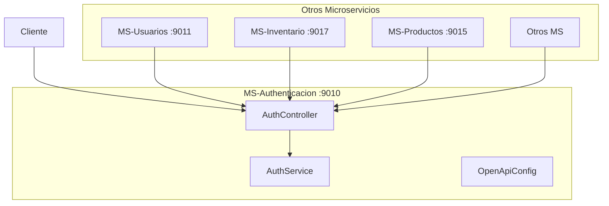
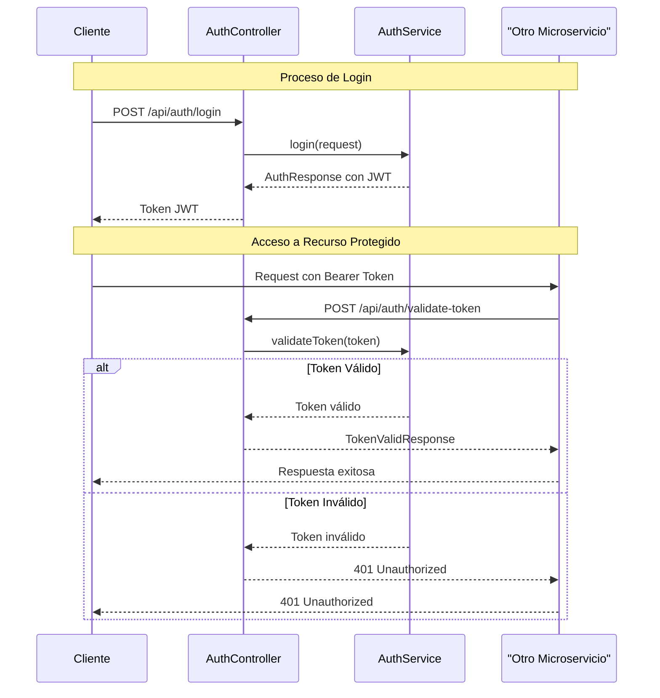
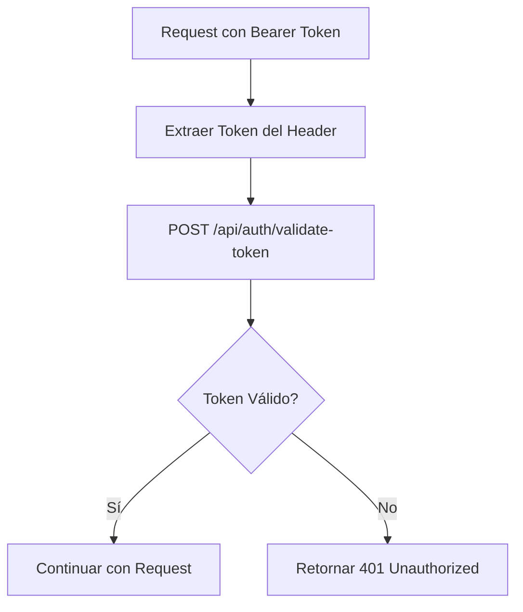

## Descripción General

El microservicio `MS-Authenticacion` es el componente central del sistema de autenticación basado en JWT para la plataforma de perfumería. Opera en el puerto 9010 y proporciona servicios de autenticación, registro de usuarios y validación de tokens para todos los demás microservicios del sistema. [1](https://www.notion.so/Documentaci-n-T-cnica-MS-Authenticacion-215e7cf34c88805ab77bead08f862467?pvs=21)

## Arquitectura del Sistema

### Componentes Principales



## Endpoints Principales

### 1. Login de Usuario

- **Endpoint**: `POST /api/auth/login`
- **Puerto**: 9010
- **Descripción**: Autentica usuarios y genera tokens JWT [2](https://www.notion.so/Documentaci-n-T-cnica-MS-Authenticacion-215e7cf34c88805ab77bead08f862467?pvs=21)

### 2. Registro de Usuario

- **Endpoint**: `POST /api/auth/register`
- **Puerto**: 9010
- **Descripción**: Registra nuevos usuarios en el sistema

### 3. Validación de Token

- **Endpoint**: `POST /api/auth/validate-token`
- **Puerto**: 9010
- **Descripción**: Valida tokens JWT para otros microservicios [3](https://www.notion.so/Documentaci-n-T-cnica-MS-Authenticacion-215e7cf34c88805ab77bead08f862467?pvs=21)

## Flujo de Autenticación

### Diagrama de Secuencia - Login y Validación



## Integración con Otros Microservicios

### AuthClientService Pattern

Todos los microservicios implementan el patrón `AuthClientService` para validar tokens: [4](https://www.notion.so/Documentaci-n-T-cnica-MS-Authenticacion-215e7cf34c88805ab77bead08f862467?pvs=21)

### Configuración de Comunicación

Los microservicios se configuran para comunicarse con MS-Authenticacion: [5](https://www.notion.so/Documentaci-n-T-cnica-MS-Authenticacion-215e7cf34c88805ab77bead08f862467?pvs=21)

## Manejo de Errores

### Excepciones de Autenticación

El controlador maneja múltiples tipos de excepciones de autenticación: [6](https://www.notion.so/Documentaci-n-T-cnica-MS-Authenticacion-215e7cf34c88805ab77bead08f862467?pvs=21)

### Códigos de Estado HTTP

| Código | Descripción | Escenario |
| --- | --- | --- |
| 200 | OK | Autenticación exitosa |
| 401 | Unauthorized | Credenciales inválidas o token expirado |
| 403 | Forbidden | Acceso denegado |
| 409 | Conflict | Usuario ya existe (registro) |
| 500 | Internal Server Error | Error interno del servidor |

## Documentación API (OpenAPI/Swagger)

### Configuración de Documentación [7](https://www.notion.so/Documentaci-n-T-cnica-MS-Authenticacion-215e7cf34c88805ab77bead08f862467?pvs=21)

### Endpoints de Documentación

- **Swagger UI**: `http://localhost:9010/swagger-ui.html`
- **API Docs**: `http://localhost:9010/v3/api-docs`

## Estructura de Datos

### Request/Response DTOs

| DTO | Propósito | Campos Principales |
| --- | --- | --- |
| `LoginRequest` | Solicitud de login | username, password |
| `RegisterRequest` | Solicitud de registro | username, email, password |
| `TokenValidationRequest` | Validación de token | token |
| `AuthResponse` | Respuesta de autenticación | message, token |
| `TokenValidResponse` | Respuesta de validación | message |

## Configuración de Despliegue

### Propiedades de Aplicación

```yaml
server:
  port: 9010

spring:
  datasource:
    url: jdbc:mysql://localhost:3306/perfumalandia_spa
    username: root
    password: [configurar]
    driver-class-name: com.mysql.cj.jdbc.Driver

auth:
  app:
    jwtSecret: [configurar-secreto-jwt]
    jwtExpirationMs: 96400000
    jwtRefresh: 2592000000

```

## Seguridad

### Características de Seguridad Implementadas

1. **Tokens JWT Stateless**: No requiere almacenamiento de sesión en servidor
2. **Validación Centralizada**: Un punto único de validación para todos los microservicios
3. **Manejo Robusto de Errores**: Respuestas consistentes para diferentes escenarios de error
4. **Documentación Segura**: Endpoints de documentación protegidos apropiadamente

### Flujo de Validación de Token



## Monitoreo y Logs

El servicio incluye logging detallado para operaciones de autenticación y manejo de errores, facilitando el monitoreo y debugging del sistema.

## Notes

Este microservicio es crítico para la seguridad de toda la plataforma, ya que todos los demás microservicios dependen de él para la validación de tokens. La configuración del `AuthClientService` en cada microservicio debe apuntar correctamente a `http://localhost:9010/api/auth/validate-token` para el funcionamiento adecuado del sistema distribuido.
