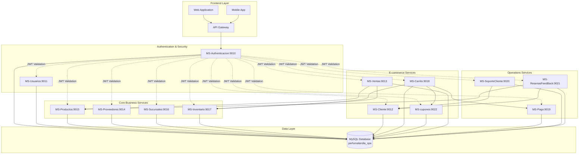
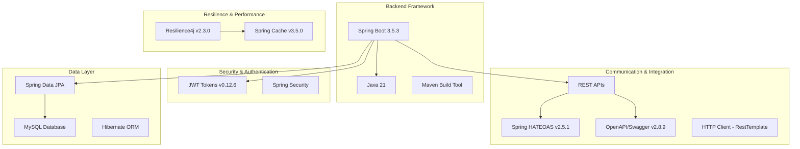
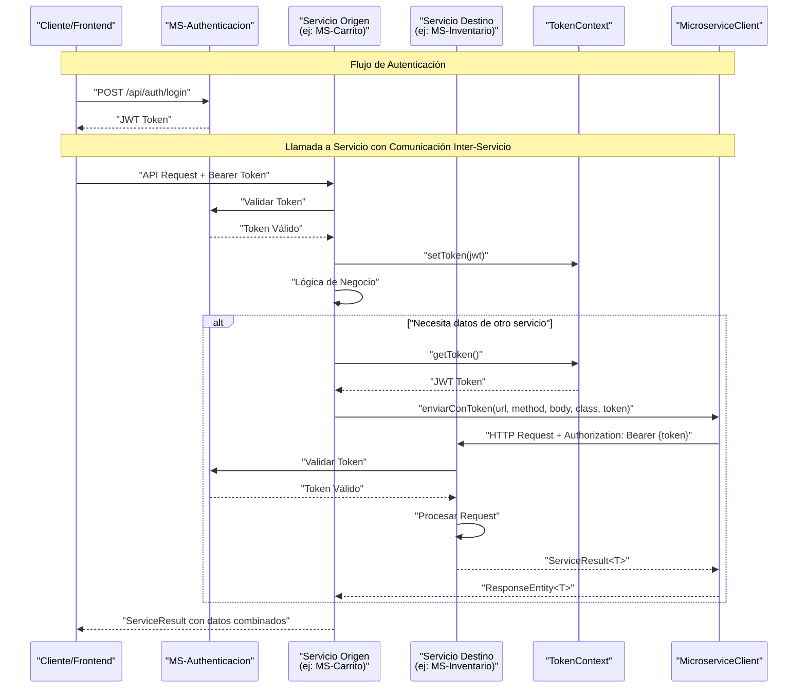
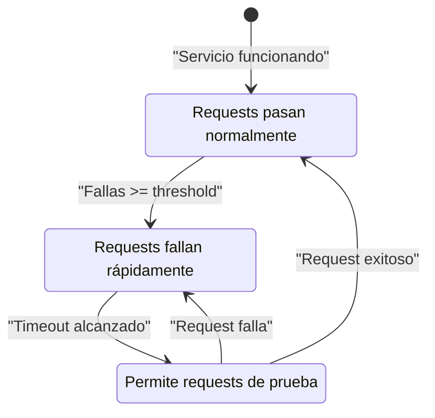
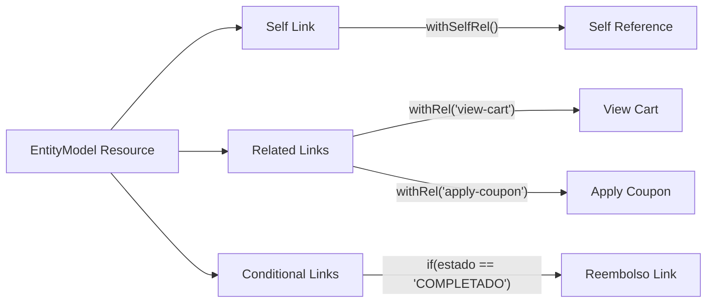
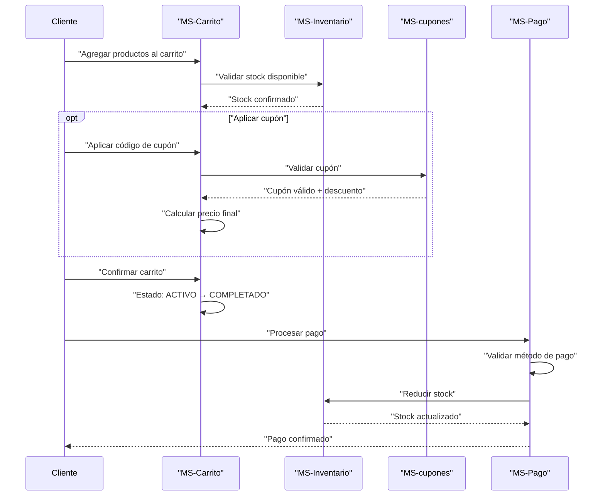

Basándome en el código del repositorio `ByAncort/backend-perfumeria`, aquí tienes el System Overview completo actualizado con todos los componentes y diagramas de arquitectura:

# System Overview

Este documento proporciona una visión general del sistema Perfumeria Backend, una arquitectura basada en microservicios diseñada para soportar un negocio de venta de perfumes. El sistema está compuesto por múltiples microservicios especializados que trabajan juntos para proporcionar funcionalidad integral para gestión de inventario, procesamiento de ventas, administración de usuarios y más. [1](#3-0) 

## Arquitectura General del Sistema

## Stack Tecnológico

## Arquitectura de Microservicios

### Microservicios Actualizados

| Microservicio | Puerto | Responsabilidad Principal | Características Clave |
|---------------|--------|---------------------------|----------------------|
| MS-Authenticacion | 9010 | Autenticación, generación y validación de tokens | Tokens JWT, login/registro |
| MS-Usuarios | 9011 | Gestión de usuarios, roles y permisos | Sistema RBAC con roles/permisos |
| MS-Cliente | 9012 | Gestión de datos y perfiles de clientes | CRUD de clientes, validación de datos |
| MS-Ventas | 9013 | Procesamiento y gestión de ventas | Procesamiento de transacciones, cancelación de ventas |
| MS-Proveedores | 9014 | Gestión de proveedores/suministradores | **Validación de RUT chileno**, CRUD de proveedores |
| MS-Productos | 9015 | Gestión de catálogo de productos | Productos, categorías, gestión de SKU, Circuit Breaker |
| MS-Sucursales | 9016 | Gestión de sucursales/tiendas | Ubicaciones de tiendas, horarios de operación |
| MS-Inventario | 9017 | Seguimiento de inventario entre sucursales | Gestión de stock, transferencias, alertas de stock bajo |
| **MS-Carrito** | **9018** | **Gestión de carrito de compras** | **Estados de carrito, cupones, HATEOAS** |
| **MS-Pago** | **9019** | **Procesamiento de pagos y reembolsos** | **Múltiples métodos de pago, HATEOAS** |
| **MS-SoporteCliente** | **9020** | **Sistema de tickets de soporte** | **Gestión de tickets, integración con clientes** |
| **MS-ResenasFeedBack** | **9021** | **Sistema de reseñas y feedback** | **Validación dual de productos y clientes** |
| **MS-cupones** | **9022** | **Gestión de cupones y descuentos** | **Cupones porcentuales y fijos** | [2](#3-1) 

## Patrón de Comunicación Entre Servicios

Los componentes clave para la comunicación entre servicios son:
- `TokenContext`: Almacena y proporciona el token JWT actual
- `MicroserviceClient`: Un wrapper alrededor de RestTemplate que agrega el token a las solicitudes
- `ServiceResult<T>`: Un wrapper de respuesta estandarizado que incluye datos o información de error [3](#3-2) 

## Nuevos Servicios de E-commerce

### MS-Carrito (Puerto 9018)
Servicio de carrito de compras con integración completa de cupones y validación de inventario.

**Características principales:**
- Estados de carrito: ACTIVO, VACIO, COMPLETADO, ABANDONADO [4](#3-3) 
- Integración con MS-Inventario para validación de stock [5](#3-4) 
- Soporte completo para cupones de descuento [6](#3-5) 
- APIs HATEOAS para navegación de recursos [7](#3-6) 

### MS-Pago (Puerto 9019)
Servicio de procesamiento de pagos con soporte para múltiples métodos de pago y reembolsos.

**Características principales:**
- Métodos de pago: TARJETA_CREDITO, PAYPAL, TRANSFERENCIA [8](#3-7) 
- Sistema de reembolsos [9](#3-8) 
- Validación de carritos antes del pago
- APIs HATEOAS completas con enlaces condicionales

### MS-SoporteCliente (Puerto 9020)
Sistema de tickets de soporte al cliente con integración a datos de clientes. [10](#3-9) 

**Características principales:**
- Gestión completa de tickets de soporte
- Validación de clientes con MS-Cliente [11](#3-10) 
- Estados de tickets y seguimiento
- Integración JWT para seguridad

## Patrones de Diseño Implementados

### 1. Circuit Breaker Pattern [12](#3-11) 

### 2. HATEOAS Pattern

## Flujo de Negocio: Proceso de Compra Completo

## Autenticación y Seguridad

El sistema utiliza un mecanismo de autenticación basado en JWT. MS-Auth genera tokens al iniciar sesión, que luego son validados por otros microservicios al procesar solicitudes. [13](#3-12) 

### TokenContext Pattern [14](#3-13) 

## Contexto de Negocio Chileno y Validación de RUT

El sistema está específicamente diseñado para el mercado chileno, con MS-Proveedores

