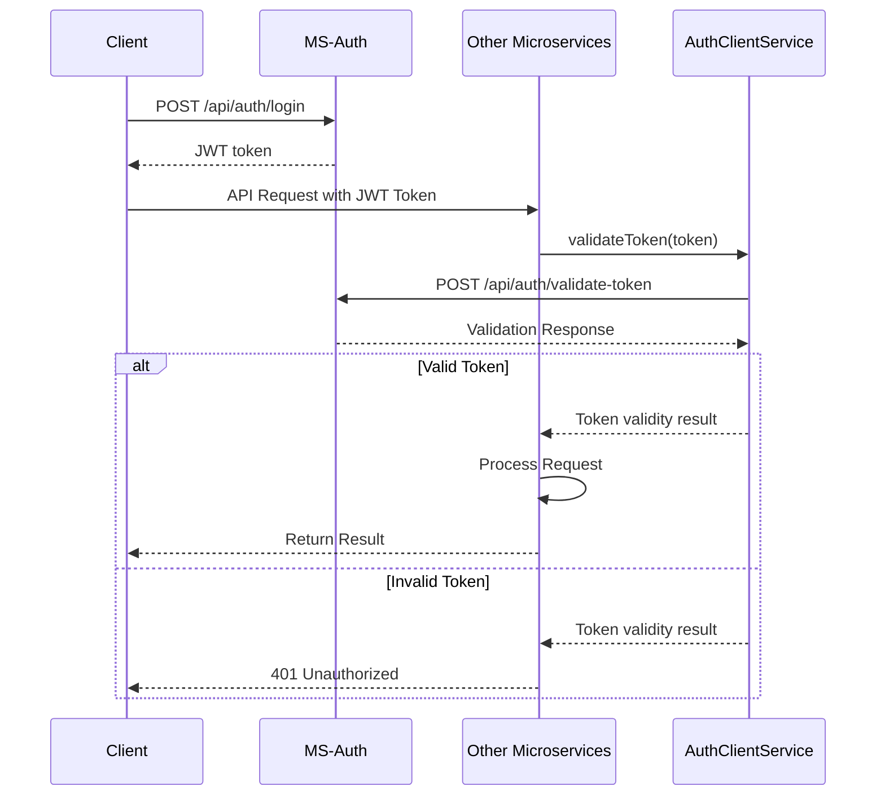

# System Overview  
  
Este documento proporciona una visión general del sistema Perfumeria Backend, una arquitectura basada en microservicios diseñada para soportar un negocio de venta de perfumes. El sistema está compuesto por múltiples microservicios especializados que trabajan juntos para proporcionar funcionalidad integral para gestión de inventario, procesamiento de ventas, administración de usuarios y más.  
  
## Arquitectura del Sistema  
  
El Perfumeria Backend implementa un patrón de arquitectura de microservicios con autenticación JWT centralizada y comunicación basada en REST entre servicios. El sistema está diseñado para el mercado chileno con características especializadas como validación de RUT.  
  
### Microservicios  
  
| Microservicio | Puerto | Responsabilidad Principal | Características Clave |  
|---------------|--------|---------------------------|----------------------|  
| MS-Authenticacion | 9010 | Autenticación, generación y validación de tokens | Tokens JWT, login/registro |  
| MS-Usuarios | 9011 | Gestión de usuarios, roles y permisos | Sistema RBAC con roles/permisos |  
| MS-Ventas | 9013 | Procesamiento y gestión de ventas | Procesamiento de transacciones, cancelación de ventas |  
| MS-Proveedores | 9014 | Gestión de proveedores/suministradores | **Validación de RUT chileno**, CRUD de proveedores |  
| MS-Productos | 9015 | Gestión de catálogo de productos | Productos, categorías, gestión de SKU |  
| MS-Sucursales | 9016 | Gestión de sucursales/tiendas | Ubicaciones de tiendas, horarios de operación |  
| MS-Inventario | 9017 | Seguimiento de inventario entre sucursales | Gestión de stock, transferencias, alertas de stock bajo |  
  
## Autenticación y Seguridad  
  
El sistema utiliza un mecanismo de autenticación basado en JWT. MS-Auth genera tokens al iniciar sesión, que luego son validados por otros microservicios al procesar solicitudes.  
##


Cada microservicio autentica las solicitudes de API validando el token JWT con el servicio MS-Auth a través de un componente `AuthClientService`.  
  
## Comunicación Entre Servicios  
  
Los microservicios se comunican entre sí utilizando llamadas a la API REST facilitadas por `RestTemplate` de Spring. La comunicación mantiene el contexto de seguridad pasando el token JWT entre servicios.  

  ```mermaid
sequenceDiagram
    box Calling Service (e.g. MS-Ventas)
        participant BusinessLogic
        participant VentaService as VentaService (26-79)
        participant MicroserviceClient
        participant TokenContext
    end
    box Called Service (e.g. MS-Inventario)
        participant InventoryAPI
    end

    BusinessLogic->>VentaService: initiateRequest()
    VentaService->>TokenContext: getCurrentToken()
    TokenContext-->>VentaService: JWT
    VentaService->>MicroserviceClient: executeWithToken()
    MicroserviceClient->>InventoryAPI: HTTP Request<br>(Authorization: Bearer {token})
    InventoryAPI-->>MicroserviceClient: ServiceResult<T>
    MicroserviceClient-->>VentaService: parsedResponse
    VentaService-->>BusinessLogic: ServiceResult<InventoryData>
```

Los componentes clave para la comunicación entre servicios son:  
- `TokenContext`: Almacena y proporciona el token JWT actual  
- `MicroserviceClient`: Un wrapper alrededor de RestTemplate que agrega el token a las solicitudes  
- `ServiceResult<T>`: Un wrapper de respuesta estandarizado que incluye datos o información de error  
  
## Procesos de Negocio Principales  
  
### Proceso de Ventas  
  
El proceso de ventas abarca múltiples microservicios, demostrando cómo trabajan juntos:  
  
1. **Crear Venta**: El cliente envía una solicitud de venta a MS-Ventas  
2. **Validación**: Para cada producto en la venta:  
   - MS-Ventas obtiene información de inventario de MS-Inventario  
   - MS-Ventas obtiene detalles del producto de MS-Productos  
   - MS-Ventas reduce el inventario en MS-Inventario  
3. **Confirmación**: MS-Ventas crea el registro de venta y confirma al cliente  
4. **Cancelación** (opcional): Si se cancela la venta:  
   - MS-Ventas restaura el inventario para cada producto  
   - MS-Ventas actualiza el estado de la venta a ANULADA  
  
## Contexto de Negocio Chileno y Validación de RUT  
  
El sistema está específicamente diseñado para el mercado chileno, con MS-Proveedores implementando validación sofisticada de RUT (Rol Único Tributario) chileno. El `ProveedorService` incluye:  
  
- **Validación de Patrón de RUT**: Usa regex `^\\d{1,8}-[\\dkK]$` para validar formato  
- **Algoritmo de Suma de Verificación**: Implementa el cálculo del dígito verificador de RUT chileno  
- **Normalización**: Elimina caracteres de formato y estandariza la entrada  
  
La validación incluye verificaciones de RUT duplicado usando `ProveedorRepository.existsByRut()` para asegurar el registro único de proveedores.  
  
## Patrón ServiceResult  
  
El sistema implementa un patrón de respuesta estandarizado a través de la clase `ServiceResult<T>`, que proporciona manejo consistente de errores en todos los servicios.  
  
El patrón se implementa consistentemente en todos los servicios, con controladores usando un método `handleServiceResult()` para convertir `ServiceResult<T>` en respuestas HTTP apropiadas.  
  
## APIs y Puertos de Comunicación  
  
Cada microservicio expone una API REST en su puerto designado:  
  
| Microservicio | Puerto | Ruta Base API | Endpoints Clave |  
|---------------|--------|---------------|-----------------|  
| MS-Authenticacion | 9010 | `/api/auth` | `POST /login`, `POST /register`, `POST /validate-token` |  
| MS-Usuarios | 9011 | `/api/roles` | `GET /all`, `POST /create`, `PUT /{role}/assign-permission/{permission}` |  
| MS-Ventas | 9013 | `/api/ventas` | `POST /`, `PATCH /{id}/anular`, `GET /listar-ventas` |  
| MS-Proveedores | 9014 | `/api/ms-inventario/proveedor` | `POST /create-proveedor`, `GET /by-rut/{rut}`, `PATCH /toggle-activo/{id}` |  
| MS-Productos | 9015 | `/api/productos` | `POST /create`, `GET /list`, `PUT /update/{id}` |  
| MS-Sucursales | 9016 | `/api/sucursales` | `POST /`, `GET /activas`, `PATCH /{id}/estado` |  
| MS-Inventario | 9017 | `/api/inventario` | `POST /`, `POST /transferencia`, `POST /{id}/vender`, `GET /bajo-stock` |  
  
## Modelo de Datos  
  
El sistema utiliza un modelo de datos distribuido donde cada microservicio gestiona sus propios datos específicos del dominio. Las relaciones clave de entidades incluyen:  
  
- **USUARIO** tiene **ROL** que contiene **PERMISO**  
- **PRODUCTO** se almacena en **INVENTARIO** que está en **SUCURSAL**  
- **PROVEEDOR** suministra **PRODUCTO**  
- **VENTA** contiene **DETALLE_VENTA** que incluye **INVENTARIO**  
- **CLIENTE** hace **VENTA** que se procesa en **SUCURSAL**  
  
## Tecnologías Utilizadas  
  
- **Framework**: Spring Boot 3.4.5  
- **Base de Datos**: MySQL  
- **Autenticación**: JWT (JSON Web Tokens)  
- **Documentación API**: OpenAPI/Swagger  
- **Comunicación**: REST APIs  
- **Lenguaje**: Java 21  
- **Gestión de Dependencias**: Maven
